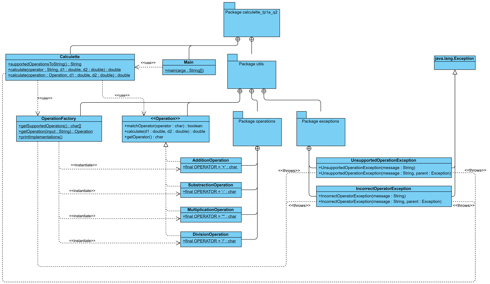

**Nom/Prénom Etudiant  :** 

Ewald JANIN


# Rapport TP1a

## Exercice 1
*Expliquer le code ajouté, présentez votre solution (diagramme UML ou texte), conclusion(s) ?*

Ma solution pour cette question n'est pas très propre et pas du tout évolutive, mais elle a l'avantage d'être très simple à mettre en place. Le code est dans le `package calculette_tp1a_q1`.

J'ai simplement créé `4 méthodes statiques` dans la classe Calculette, qui prennent en paramètre 2 doubles, font l'opération correspondant au nom de la méthode, et renvoient un double correspondant au résultat.

Dans la classe `Main`, j'ai modifié un peu la méthode `main` pour qu'après avoir vérifié si la chaîne correspondant à l'opérateur souhaitée est bien d'une longueur de 1, on cherche l'opérateur avec un `switch...case`. Si le caractère entré n'est pas un opérateur, on affiche un message d'erreur à l'utilisateur, sinon le résultat de l'opération.

Très simple à mettre en place (il ne m'a fallu que quelques minutes), cette architecture est néanmoins `très difficile à faire évoluer`, puisqu'il va falloir `modifier les 2 classes` à chaque évolution, et n'est pas très propre.

## Exercice 2
*Expliquer le code ajouté, présentez votre solution (diagramme UML ou texte), conclusion(s) ?*

Pour cette question, ma solution a nécéssité un peu plus d'architecture que la solution précédente. Toutes les classes se trouvent dans le `package calculette_tp1a_q2` et ses sous-packages.

La classe `Main` sert toujours à récupérer l'input utilisateur, même si dans l'absolu il aurait fallu utiliser une classe spécifique pour le faire. Elle utilise une méthode statique de la classe `Calculette`, `supportedOperationsToString` (qui fait elle-même appel à la méthode statique `getSupportedOperators` de `OperationFactory`), pour afficher à l'utilisateur les symboles représentant les opérations implémentées actuellement. Après avoir récupéré les entrées utilisateur, elle fait appel à la méthode statique `calculate` toujours de la classe `Calculette` et lui passe les données en paramètres. Cette méthode fait elle-même appel à la méthode `getOperation` de `OperationFactory` pour récupérer une instance d'une classe implémentant l'interface `Operation` et correspondant à l'opérateur choisi par l'utilisateur (si l'opérateur ne correspond à aucune opération, une exception personnalisée est levée et un message est affiché). La méthode `calculate`de `Calculette` renvoie ensuite le résultat de l'appel à la méthode `calculate` de l'instance d'`Operation` récupérée avec pour paramètre les nombres choisis par l'utilisateur.

La classe `OperationFactory` utilise la librairie `Reflections version 0.9.12`, que j'importe avec `Maven` dans mon  fichier `pom.xml`. Pour récupérer la bonne classe en fonction de l'opérateur entré par l'utilisateur et l'instancier, on parcourt toutes les classes du `sous-package operations`et qui implémentent l'interface `Operation`. On vérifie si l'opérateur défini dans chacune des classes correspondantes correspond à celui qui est passé en paramètre, et on crée un instance de la première classe trouvée qui correspond. Si l'entrée de l'utilisateur ne correspond pas (n'est pas un seul caractère, ne correspond à aucune opération...), on lève une exception personnalisée du sous-package `exceptions`, qui sera traitée plus haut. Pour récupérer les opérateurs de toutes les opération supportées, le principe est le même, sauf que l'on ne crée pas d'instance, on se contente de renvoyer un tableau avec tous les caractères.

Cette solution avec la classe `OperationFactory`peut paraître un peu compliquée et un peu farfelue, mais elle présente l'avantage de n'avoir strictement aucune classe à toucher pour ajouter une nouvelle opération, rien à ajouter dans une `enum`  ou un `switch ... case` quelque part. Il suffit de copier une des classes opération existante dans le `sous-package operations`, et de la modifier pour qu'elle corresponde à l'opération que l'on souhaite ajouter (donc changer juste l'attribut `OPERATOR` et la méthode `calculate`).

J'aurai voulu utiliser des méthodes statiques dans les classes opérations, mais j'ai préféré utiliser une interface qu'un héritage.

Ci-dessous, le diagramme UML correspondant à cette question.



L'utilisation du **pattern Strategy** m'a demandé plus de temps pour développer ma solution initialement, mais les possibilités d'évolutions sont à la fois bien plus vastes et bien plus simples, puisque je n'ai aucun code existant à modifier pour ajouter une opération. Dans l'absolue, une évolution qui nécéssiterai de modifier un peu mon code serait de ne pas utiliser un caractère (`char`) mais une chaîne de caractères `String` pour l'opérateur, ce qui permettrait plus de flexibilité. Mais cela ne prendrait que quelques minutes.

## Exercice 3
*Expliquer le code ajouté: présentez votre solution (diagramme UML ou texte), conclusion(s) ?*

J'ai complété l'interface HappyHourStrategy en ajoutant la méthode `calculateNewPrice(Beer)`, que j'ai complétée dans chacune des classes implémentant l'interface `HappyHourStrategy`. J'ai également fait en sorte que `PubWaiter` utilise cette méthode pour calculer le prix d'une bière.

J'ai ajouté les classes de tests unitaires par stratégie de réduction, ajouté la classe correspondant à une réduction de 50%, et je l'ai ajoutée aux tests de la classe `HappyHourTest`.

## Votre avis sur le pattern Strategy
*Que retirez vous de son utilisation? Est-ce que c'est utile? ...*

Ce design pattern nécéssite de plus penser à la conception avant de commencer à coder, mais il permet une bonne évolutivité du code, une bonne séparation des objets (pour éviter les [God objects](https://en.wikipedia.org/wiki/God_object)). L'architecture du programme est ainsi plus claire, il est plus facile d'intervenir dans le programme après une longue période sans le toucher, et cela permet d'avoir une structure asseez facilement compréhensible par un autre développeur.

## Votre avis sur le TP et les exercices

### Ce que vous avez aimé

*Donnez votre avis*

Un projet est à mon sens toujours plus intéressant que des exercices type TD pour mettre en application nos connaissances. Le fait d'être bien guidé dans ce TP est agréable, et notamment j'apprécie particulièrement le format du rapport en Markdown, beaucoup plus pratique qu'un rapport à faire sous Word, et le fait qu'il soit bien guidé est très confortable.

### Ce que vous n'avez pas aimé

*Donnez votre avis*

Cette partie du TP était peut-être un peu trop guidée, surtout pour la question 3, j'en ai même l'impression d'avoir loupé une consigne.

### Propositions d'améliorations

*Donnez votre avis*

Peut-être donner un peu plus de temps aux étudiants et les laisser développer eux-mêmes un peu plus la question 3 ?

Et aussi donner en consigne le code **XML** pour importer la libraire **jUnit**, il m'a fallu un peu de temps pour y arriver, avec les différentes versions et les différents artefacts.

Vous pourriez même donner directement un projet Maven aux étudiants.

Dépendances à ajouter au `pom.xml` pour jUnit : 
```
<dependencies>
    <dependency>
        <groupId>org.junit.platform</groupId>
        <artifactId>junit-platform-launcher</artifactId>
        <version>1.6.2</version>
        <scope>test</scope>
    </dependency>
    <dependency>
        <groupId>org.junit.jupiter</groupId>
        <artifactId>junit-jupiter-engine</artifactId>
        <version>5.6.2</version>
        <scope>test</scope>
    </dependency>
    <dependency>
        <groupId>org.junit.vintage</groupId>
        <artifactId>junit-vintage-engine</artifactId>
        <version>5.6.2</version>
        <scope>test</scope>
    </dependency>
    <dependency>
        <groupId>junit</groupId>
        <artifactId>junit</artifactId>
        <version>4.13</version>
    </dependency>
</dependencies>
```


