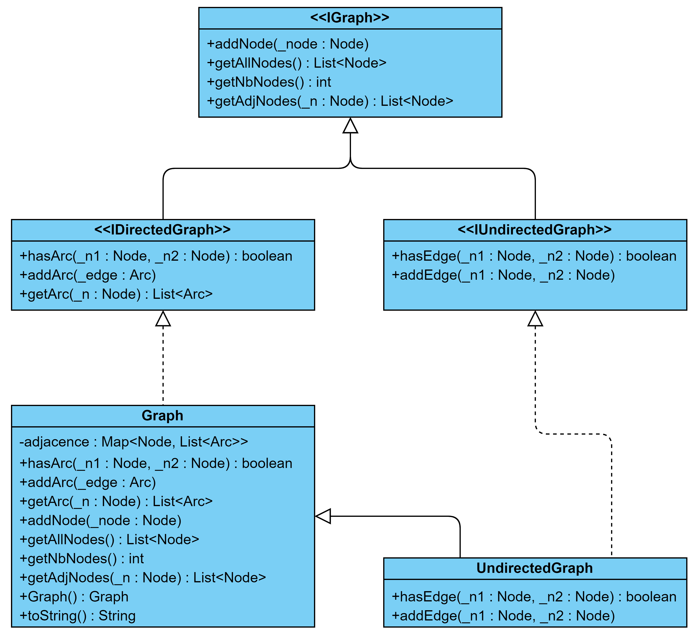
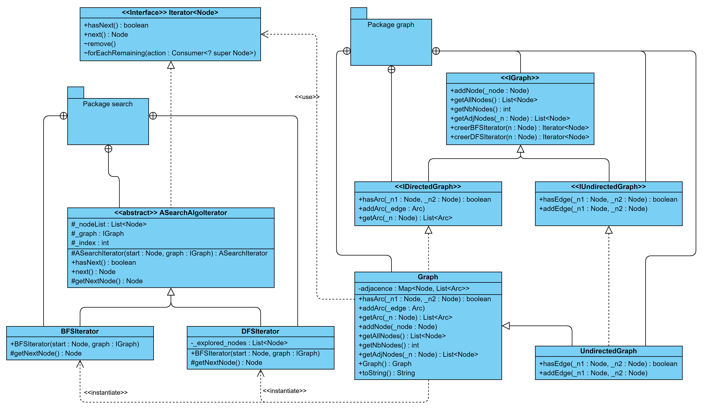

**Nom/Prénom Etudiant :**
Ewald JANIN

# Rapport TP1b

## Question 1
*Expliquer le code ajouté*

J'ai complété la classe `Graph`.

Pour la méthode `getAllNodes`, on va créer un ArrayList qui contient toutes les clés de la `Map` des noeuds et des arcs du graphe (`adjacence`).

Pour connaître le nombre de noeuds du graphe, on renvoie tout simplement la taille de cette même `Map`, puisque les clés sont les noeuds du graphe, et qu'il ne peut pas y avoir une clé dupliquée dans un `Map`.

Pour récupérer tous les noeuds adjacents à un noeud donné, on va tout simplement parcourir les arcs de ce noeud, et ajouter les noeuds de destination à une `List` avant de la renvoyer.

Dans la méthode `toString`, on itère à travers les noeuds du graphe, pour afficher le label du noeud et tous les arcs de celui-ci. On utilise au maxium les méthodes déjà définies dans la classe `Graph`.

## Question 2
*Expliquer le code ajouté et insérer un schéma du patron de conception mis en place*

La classe `UndirectedGraph` est très simple, et a seulement deux méthodes. Elle implémente l'interface `IUndirectedGraph` et hérite de la classe `Graph`. 

Les deux méthodes de la classes sont celles définies dans l'interface `IUndirectedGraph`, c'est à dire `addEdge` et `hasEdge`. Elles utilisent les méthodes `addArc` et `hasArc` de la classe `Graph` pour modéliser un graphe non orienté (en ajoutant l'arête comme étant un arc dans les deux sens) et non valué (en choisissant une valuation `null` pour les arêtes).

J'ai mis en place un **pattern Template Method** un peu adapté, dont le diagramme UML est ci-dessous.

## Question 3
*Expliquer le code ajouté et insérer un schéma du patron de conception mis en place*

## Question 4
*Expliquer le code ajouté et insérer un schéma du patron de conception mis en place*

